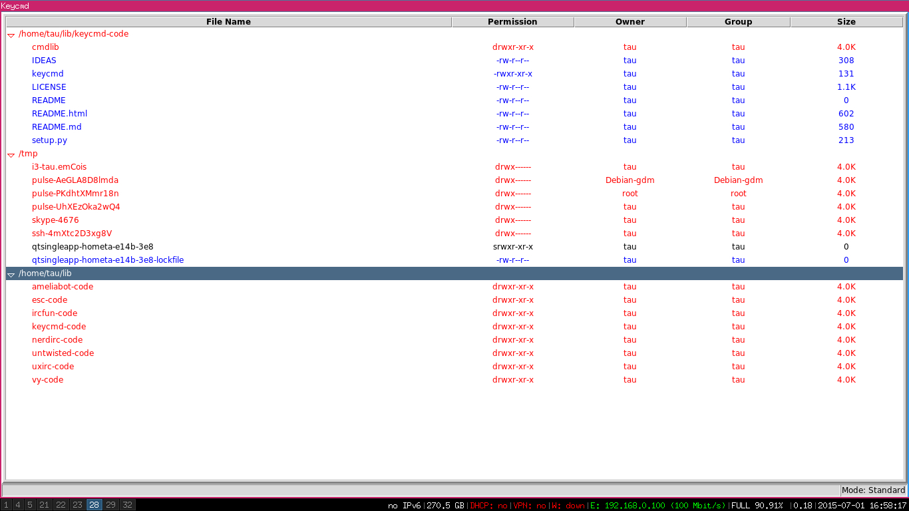

keycmd
======

A modal file manager. Keycmd is a very flexible file manager, probably the most flexible one that exists.

Overview
========

A file system can be abstracted as a tree. Subdirectories can be seen as nodes of such a tree. 
Keycmd has the feature of viewing a file system as a set of nodes, such nodes correspond to directories
of the tree. The nodes are grouped into a sequential style.

Videos
======

I'm using i3 wm and keycmd in this video.
The video shows how you can quickly manage files with keycmd.

https://youtu.be/JdTZu06NDQM

https://youtu.be/NXUz4Vp_sco

Installation
============
Supposing you have keycmd code in a directory named keycmd-code.

    su
    apt-get install usbmount
    apt-get install zip
    exit

Installation as user

    cd keycmd-code
    python setup.py install --user
    
Or
    cd keycmd-code
    python setup.py install

as root.

Basic usage
===========

The scheme below introduces a simple idea of how keycmd works.

The line whose background is blue is the cursor. It is used to select files/directories to have commands performed on.
The lines with a small delta at the beginning are the nodes of the tree. It is possible to have as many nodes as necessary.
The lines below a view are named subviews. These are files belonging to the view/dir.

I'll refer to nodes as views sometimes, so a view in this context is the same as a node. Keycmd is a modal file manager
it can have as many modes as you want. There is no need for mouse at all. Everything is done with the keyboard.

I believe that the best way to learn a modal thing is through examples. I'll walk you through basic examples of usage it is
important to have keycmd running.

**Getting ready to start**

First of all, you need to create some files and directories to play around with cmd.

    cd ~
    mkdir alpha
    cd alpha
    mkdir dir1
    mkdir dir2
    cd dir1
    echo '' >> file1
    cd ..
    cd dir2
    echo '' >> file2

Once you have created these files, it is time to run keycmd.

Type in a terminal 

    keycmd

that should be enough to launch the program.

Keycmd for default opens a view corresponding to the user home directory.
If you have created the files above then the directory alpha should be listed
in a view.

**Changing cursor position**

The most useful set of keys are the keys 'Key-j' and 'Key-k', these keys are
responsible by moving the cursor down and up. 

Test it until you getting comfortable.

**Opening views**

It is possible to have as many views as needed. You'll find yourself opening a lot of views in some situations
to move, copy files from a directory to other. You can open views for directories and files. 

Put the cursor over the directory alpha then type 'Key-c'. It will open a view for the directory alpha with
all the files and directories listed under this view.

Try it with dir1 and dir2.

**Changing cursor between views**

Once you have followed the steps above you'll have some views opened. Now, try the keys 'Key-h' and 'Key-l'
These keys move the cursor one view up and one view down.

**Select files**

Some commands perform operations based on selected views/subviews. In order to select
a view or a subview you put the cursor over the given item then press 'Key-s'
You can have selections under multiple views.

Try it out !

**Unselect files**

To unselect a given view/subview you just put the cursor over then press 'Key-s'.

**Delete some files**

Deleting files works altogether with selecting files. You first select the files to be removed
then press 'Key-d' to delete them.

**Remove a view**

Sometimes you don't need to work with a view anymore then you can
remove it with 'Key-z' when the cursor is over it or over one of its subviews.

Try opening a view for alpha twice then press 'Key-z' when the cursor is over the view alpha
or over one of its subviews.

**Changing a directory view**

Sometimes you don't need another view, you just need to go a directory down or a directory up
from a given view. You use the key 'Key-e' to change a view path. Put the cursor
over a given subview that matches a directory then type 'Key-e' it will make the view of that
subview turn into the subview's path. 

**Going a directory up**

You will find situations that you need to go a directory upwards from a given view.
If your view lists the file of a directory named /home/tau/dir and you want
that view to list files from /home/tau, all you need to do is putting the cursor
over the view /home/tau/dir or over one of its subviews then pressing 'Key-b'.

Try it out.

**Creating a file**

In order to create a file you put the cursor over a view then press 'F1'.
It will open an edit area where you will type the filename.

**Creating a directory**

Put the cursor over a view then type 'F2', it opens an edit area where to type
the dir name.

**Renaming files**

Put the cursor over a view or a subview then press 'F3', it will open an edit area
where to insert the new name.

**Quickly changing cursor to a view/subview**

Keycmd supports a mode named Quick Search which permits you to type
some simple patterns then quickly change the cursor to a given subview.

Once you press 'Key-backslash' or '\' in standard mode it will enter quick search mode.
Whatever you type will be interpreted as a pattern. The pattern appears on the statusbar.
You can type backspace to erase a letter in case you have mistaken.
When it finally sets the cursor over the right item then you can type 'Esc'
to go back to standard mode.

**Copying dirs/files**

The way to copy files with keycmd consists of selectiong a set of views or subviews
then putting the cursor over a given view or subview then pressing 'Key-y'.
Keycmd will copy whatever is selected to the directory whose cursor is over.

**Mounting filesystems**
It is possible to implement a key command to execute mount command
to mount some device. I haven't felt that need so far. Whenever
i need to mount usb storages there is the usbmount package which does it for me.

**Configuration file**

Keycmd has a configuration file where you can set options for the plugins as well as
set some personalized stuff for the graphical interface. Set which plugins should be loaded etc.

The file is cmdrc and should be created in your home directory inside .keycmd after
keycmd is launched for a first time.

The file cmdrc is a python script that is executed wheneer keycmd is launched.

~~~python

# cmdrc

import sys
##############################################################################

from os.path import expanduser
sys.path.append('%s/.keycmd/' % expanduser('~'))
##############################################################################

# Functions used to load the plugins.
from cmdlib.modes import autoload, autocall
##############################################################################
# Important plugins.

# Define the modes.
import cmdlib.modes.setmod
autoload(cmdlib.modes.setmod)

##############################################################################
# modes, plugins.

# The basic set of key commands that keycmd supports.
import cmdlib.modes.standard
autoload(cmdlib.modes.standard)

# Used to update the statusbar mode field in which keycmd is in.
import cmdlib.modes.status
autoload(cmdlib.modes.status)

# Used to quickly jump to views/subviews.
import cmdlib.modes.qsearch
autoload(cmdlib.modes.qsearch)

# This is the openwith plugin that defines a set of applications
# to be used when opening files.
# This is the set of applications for default. You should
# append or modify this mapping according to your needs.
import cmdlib.modes.openwith
autoload(cmdlib.modes.openwith,
         map={'.py': 'vy',
              '.pdf': 'evince',
              '.djvu': 'evince',
              '.c': 'vy',
              '.jpg': 'feh',
              '.exe': 'wine',
              '.png': 'feh',
              '.mp4': 'mplayer',
              '.html': 'google-chrome'},
         default='vy')

# Used to unpack files.
import cmdlib.modes.zip
autoload(cmdlib.modes.zip)

# Basic commands.
import cmdlib.modes.command
autoload(cmdlib.modes.command)

##############################################################################

# This function is called when keycmd launches and is used
# to set configurations for keycmd.
def setup(view):
    view.tag_configure('d', foreground='red')        # Set the color for directories.
    view.tag_configure('-', foreground='blue')       # Set the color for files.
    view.tag_configure('sel', background='white')     # Set the color for selected items.

    # Used to set background, foreground colors.
    import ttk
    ttk.Style().configure("Treeview", background="black", 
                          foreground="green", fieldbackground="black")
    
autocall(setup) 

~~~

You should modify the mapping passed to openwith mode according to your needs.

**Opening files**

Once you have set your default applications to open files inside ~/.keycmd/cmdrc then
you will able to open files based on their extension.

Suppose you have defined to open '.c' files with gedit, if you put the cursor
over a file named 'cool.c' then type 'Key-o' it will launch gedit with the cool.c file
opened in it.

**Opening files with default applications**

The parameter default='vy' passed to the autoload function in the cmdrc file
determines with which application the command 'Key-i' will work with.
Sometimes you don't want to open a .html file with a browser but with an editor
in that case you can put the cursor over the .html file then type 'Key-i'
it would launch vy(that is my vim like editor in python) with the html file opened in it.

**Moving files**

Moving files works pretty much like copying files. You selected the files
then put the cursor over a given view/subview then press 'Key-m'.

**Adding a view from path.**

Sometimes you may need to add a view from a text path.
You do so by pressing 'Key-t' then inserting the path then pressing
'Return'

Contributors
============

rabbitear at irc.freenode.org who pointed out a bug with cmdlib.ask.

Help
====

For help you can find us at irc.freenode.org on #vy

